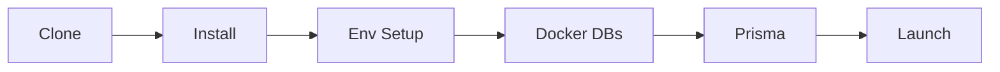
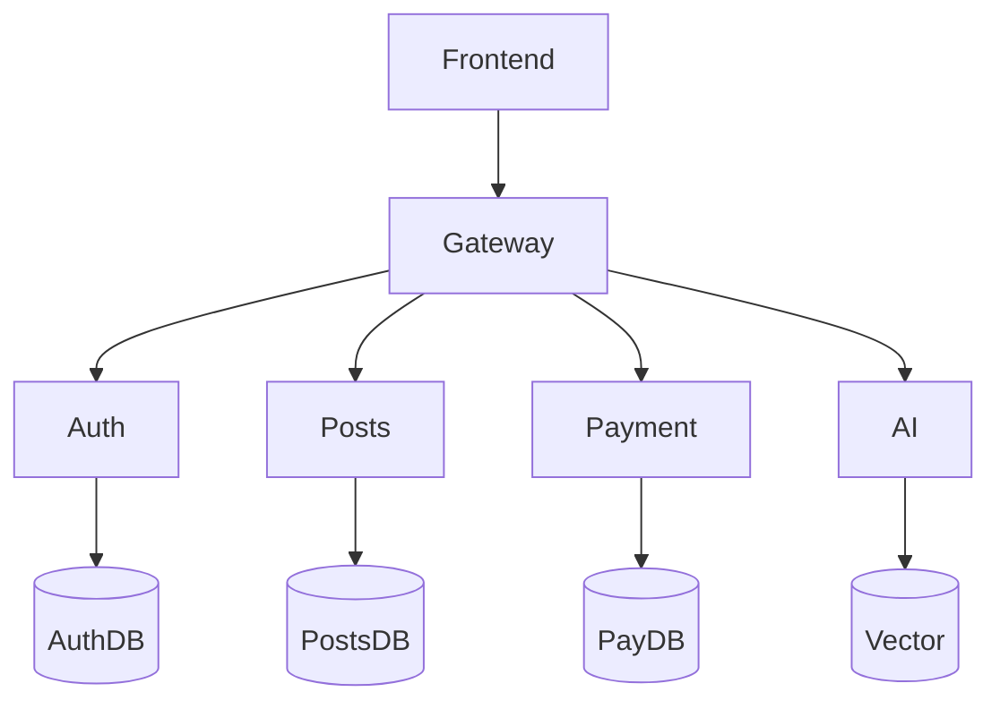

# 🚀 Getting Started with LUFF.

<p align="center">
  
  
  
</p>

> **From zero to a running microservices stack in 6 steps.** This guide walks you through every command, every file, and every credential you need.

---

## 📋 Prerequisites

| Tool | Version | Why You Need It | Install |
|:---:|:---:|:---|:---:|
| **Node.js** | `≥ 20.x` | Runtime for all services | [↗](https://nodejs.org) |
| **npm** | `≥ 10.x` | Workspace dependency management | Bundled with Node |
| **Docker** | `≥ 24.x` | Runs isolated PostgreSQL databases | [↗](https://docs.docker.com/get-docker) |
| **Git** | `≥ 2.x` | Clone the repository | [↗](https://git-scm.com) |

```bash
# Verify everything is installed
node -v && npm -v && docker -v && git --version
```

---

## 🛠️ Step-by-Step Setup



---

### 1️⃣ Clone & Install

```bash
git clone https://github.com/Luff-Org/Luff-Boilerplate.git
cd Luff-Boilerplate
npm install
```

> This installs dependencies for **all** workspaces (frontend + 5 backend services + shared packages) via npm workspaces + Turborepo.

<details>
<summary>⚠️ Troubleshooting: <code>npm install</code> fails</summary>

- Ensure Node.js ≥ 20: `node -v`
- Clear npm cache: `npm cache clean --force`
- Delete `node_modules` and `package-lock.json`, then retry

</details>

---

### 2️⃣ Environment Variables

```bash
bash scripts/setup-envs.sh
```

This copies all `.env.example` → `.env` files across every service automatically.

<details>
<summary>📁 What gets created</summary>

| Service | Env File | Key Variables |
|:---|:---|:---|
| Frontend | `frontend/.env` | `NEXT_PUBLIC_API_URL`, `NEXT_PUBLIC_GOOGLE_CLIENT_ID` |
| Auth | `backend/auth/.env` | `GOOGLE_CLIENT_ID`, `GOOGLE_CLIENT_SECRET`, `JWT_SECRET` |
| Posts | `backend/posts/.env` | `DATABASE_URL`, `JWT_SECRET` |
| Payment | `backend/payment/.env` | `RAZORPAY_KEY_ID`, `RAZORPAY_KEY_SECRET`, `DATABASE_URL` |
| AI | `backend/ai-service/.env` | `GEMINI_API_KEY`, `UPSTASH_VECTOR_REST_URL/TOKEN` |
| Gateway | `backend/api-gateway/.env` | `PORT`, `CORS_ORIGIN` |

</details>

---

### 3️⃣ Start Database Cluster

```bash
docker compose -f docker/docker-compose.yml up auth-db posts-db payment-db -d
```

Verify all containers are healthy:

```bash
docker ps
```

| Container | Port | Database | Purpose |
|:---|:---:|:---|:---|
| `auth-db` | `5433` | `auth_db` | Users, OAuth tokens |
| `posts-db` | `5434` | `posts_db` | Community posts & content |
| `payment-db` | `5435` | `payment_db` | Transaction ledgers |

<details>
<summary>⚠️ Troubleshooting: <code>ECONNREFUSED</code> on database</summary>

```bash
# Check if Docker is running
docker info

# Restart the database containers
docker compose -f docker/docker-compose.yml down
docker compose -f docker/docker-compose.yml up auth-db posts-db payment-db -d
```

</details>

---

### 4️⃣ Prisma Schema Hydration

Each service has its own isolated Prisma schema. Generate clients and push schemas:

```bash
# Auth service
cd backend/auth && npm run db:push && npm run db:generate && cd ../..

# Posts service
cd backend/posts && npm run db:push && npm run db:generate && cd ../..

# Payment service
cd backend/payment && npm run db:push && npm run db:generate && cd ../..
```

<details>
<summary>⚠️ Troubleshooting: <code>Cannot find module 'prisma/generated/client'</code></summary>

```bash
cd backend/<problematic-service>
npm run db:generate
```

Each service uses an isolated local Prisma generated folder to avoid monorepo type collisions.

</details>

---

### 5️⃣ Configure Credentials

> **💡 You can skip credential setup initially** — the app will run, but Google Login, Payments, and AI Chat won't function until configured.

<details>
<summary><b>🧠 AI Service — Gemini 2.5 + Upstash Vector (Recommended First)</b></summary>

| Platform | What to Get | Where to Put It |
|:---|:---|:---|
| [Google AI Studio](https://aistudio.google.com/app/apikey) | `GEMINI_API_KEY` | `backend/ai-service/.env` |
| [Upstash Console](https://console.upstash.com/vector) | `REST_URL` + `TOKEN` | `backend/ai-service/.env` |

1. Generate a Gemini API Key (select Gemini 2.5 Flash)
2. Create a Vector Index with **768 dimensions**
3. Copy the REST URL and Token into your `.env`

</details>

<details>
<summary><b>🔐 Auth — Google OAuth</b></summary>

| Platform | What to Get | Where to Put It |
|:---|:---|:---|
| [Google Cloud Console](https://console.cloud.google.com/apis/credentials) | `CLIENT_ID`, `CLIENT_SECRET` | `backend/auth/.env` + `frontend/.env` |

1. Create a new project → Configure OAuth Consent Screen
2. Create OAuth 2.0 Client ID (Web application)
3. Authorized redirect: `http://localhost:4000/auth/callback/google`
4. Copy Client ID & Secret into both `.env` files

</details>

<details>
<summary><b>💳 Payments — Razorpay</b></summary>

| Platform | What to Get | Where to Put It |
|:---|:---|:---|
| [Razorpay Dashboard](https://dashboard.razorpay.com/) | `KEY_ID`, `KEY_SECRET` | `backend/payment/.env` + `frontend/.env` |

1. Sign up and enable **Test Mode**
2. Go to Settings → API Keys → Generate
3. Copy Key ID and Key Secret into `.env`

</details>

---

### 6️⃣ Launch Everything

```bash
npm run run-local
```

This script automatically:
- Clears port conflicts (4000–4004)
- Ensures Docker databases are running
- Launches all services in parallel via Turborepo

---

## ✅ Verify It Works

### Health Checks

```bash
curl http://localhost:4000/health   # Gateway
curl http://localhost:4001/health   # Auth
curl http://localhost:4002/health   # Posts
curl http://localhost:4003/health   # Payment
```

### Open the App

| What | URL |
|:---|:---|
| 🖥️ **Web Application** | [http://localhost:3000](http://localhost:3000) |
| 🛡️ **API Gateway** | [http://localhost:4000](http://localhost:4000) |

---

## 🗺️ Full Service Map



---

## 🛑 Stopping Everything

```bash
# Stop Node.js services → Ctrl+C

# Stop databases
docker compose -f docker/docker-compose.yml down

# Wipe database data completely
docker compose -f docker/docker-compose.yml down -v
```
