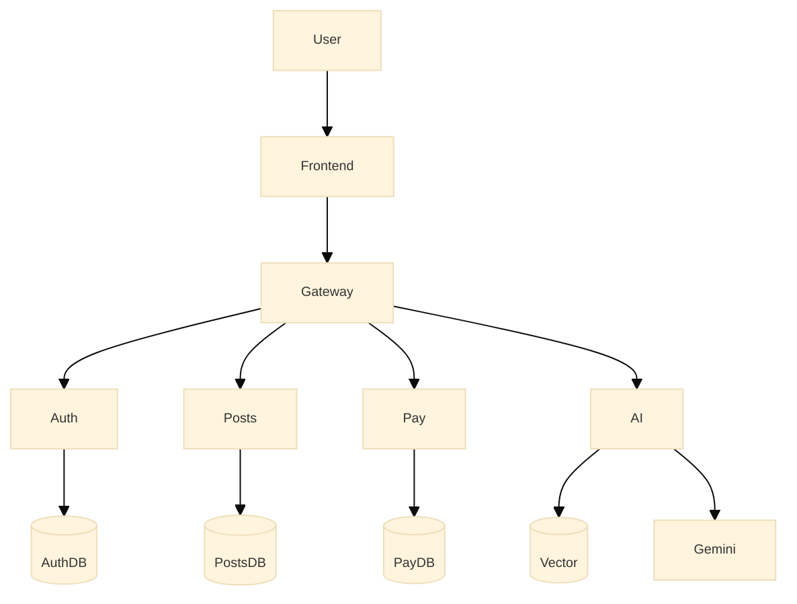
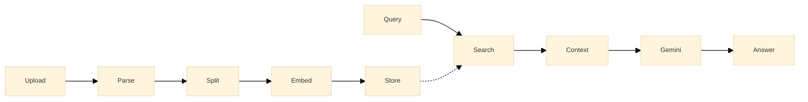
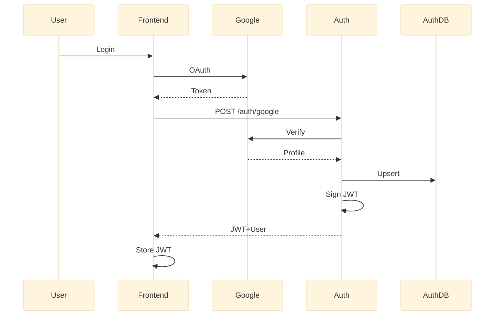
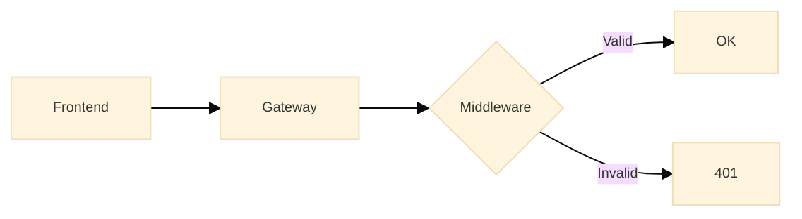
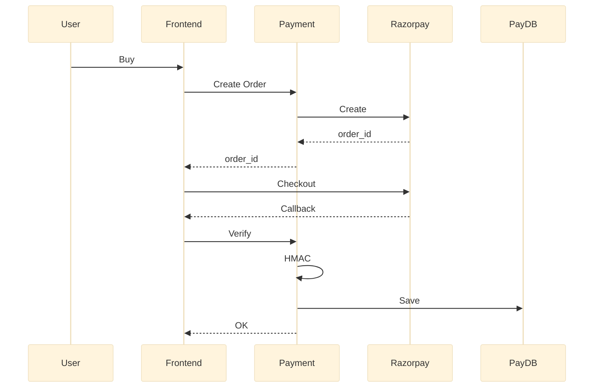
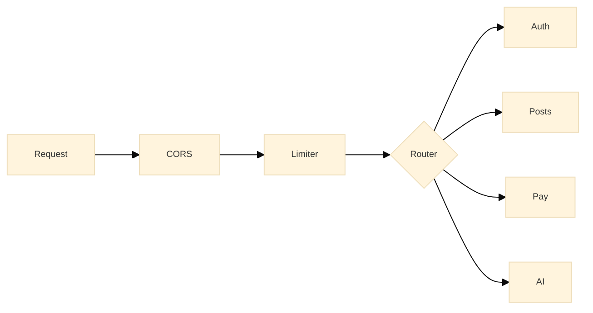
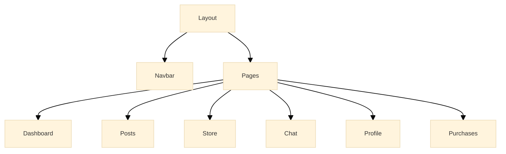
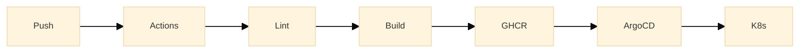

# 📘 LUFF. Technical Manual

  
  
  

> A comprehensive deep-dive into every architectural decision, data flow, and service boundary in the LUFF. ecosystem.

---

## 🧬 1. System Architecture

### Key Principles

| Principle | Implementation |
|:---|:---|
| **Service Isolation** | Each microservice has its own DB, Prisma schema, and deployment unit |
| **Single Entry Point** | All traffic flows through the API Gateway — no direct service access |
| **Stateless Auth** | JWT tokens with no server-side sessions |
| **Domain Boundaries** | Auth, Content, Payments, and Intelligence are separate domains |

---

## 🧠 2. AI Service — Deep Dive

The AI domain is the most architecturally significant service — providing production-ready intelligence.

### RAG Pipeline Flow

### AI Capabilities

| Feature | Technology | Details |
|:---|:---|:---|
| **Chat** | Gemini 2.5 Flash | Direct conversational AI with low latency |
| **RAG** | Upstash Vector | PDF-grounded answers using semantic retrieval |
| **Embeddings** | 768-dimensional | Optimized for Gemini's embedding model |
| **PDF Parsing** | pdfjs-dist | Multi-page document extraction |

### AI Routes

| Route | Method | Auth | Description |
|:---|:---:|:---:|:---|
| `POST /ai/ask` | POST | ✅ | Send a message, get AI response (generic or RAG) |
| `POST /ai/upload-pdf` | POST | ✅ | Upload PDF for RAG indexing |

---

## 🔐 3. Authentication — End-to-End Flow

### How JWT Flows Across Services

> Every backend service shares the same `JWT_SECRET` and runs identical middleware. The Gateway does **not** validate tokens — each service handles its own auth.

### Auth Routes

| Route | Method | Auth | Description |
|:---|:---:|:---:|:---|
| `POST /auth/google` | POST | ❌ | Exchange Google token for JWT |
| `GET /auth/me` | GET | ✅ | Get current user profile |

---

## 💳 4. Payment Service — Transaction Architecture

### Payment Routes

| Route | Method | Auth | Description |
|:---|:---:|:---:|:---|
| `POST /payments/create-order` | POST | ✅ | Generate Razorpay order ID |
| `POST /payments/verify` | POST | ✅ | Verify payment signature (HMAC-SHA256) |
| `GET /payments/my-purchases` | GET | ✅ | Fetch user's transaction history |

### Security Model

| Layer | Implementation |
|:---|:---|
| **Server-side orders** | Orders are created on the backend — amount cannot be tampered |
| **Signature verification** | HMAC-SHA256 using Razorpay secret prevents forged payments |
| **Transaction ledger** | Every verified payment is stored in isolated `payment_db` |

---

## 📝 5. Posts Service — Community Engine

| Route | Method | Auth | Description |
|:---|:---:|:---:|:---|
| `GET /posts` | GET | ❌ | List all posts (public) |
| `POST /posts` | POST | ✅ | Create post (authenticated) |
| `DELETE /posts/:id` | DELETE | ✅ | Delete own post (owner enforcement) |

- **Owner Enforcement**: Users can only delete their own posts — the service compares `req.user.id` with the post's `authorId`
- **Database**: Isolated PostgreSQL (`posts_db`) with Prisma ORM

---

## 🛡️ 6. API Gateway — Orchestration Hub

| Feature | Implementation |
|:---|:---|
| **Proxy** | `http-proxy-middleware` for transparent request forwarding |
| **CORS** | Whitelist `localhost:3000` (configurable) |
| **Rate Limiting** | Prevents abuse on all endpoints |
| **Health Check** | `GET /health` returns service status |

---

## 🔑 7. Credentials Matrix

| Platform | Secrets Needed | Target `.env` File(s) | Console Link |
|:---|:---|:---|:---:|
| **Google AI Studio** | `GEMINI_API_KEY` | `backend/ai-service/.env` | [↗](https://aistudio.google.com/app/apikey) |
| **Upstash** | `REST_URL`, `TOKEN` | `backend/ai-service/.env` | [↗](https://console.upstash.com/vector) |
| **Google Cloud** | `CLIENT_ID`, `CLIENT_SECRET` | `backend/auth/.env`, `frontend/.env` | [↗](https://console.cloud.google.com/apis/credentials) |
| **Razorpay** | `KEY_ID`, `KEY_SECRET` | `backend/payment/.env`, `frontend/.env` | [↗](https://dashboard.razorpay.com/) |
| **Shared** | `JWT_SECRET` | All backend `.env` files | — |

---

## 📦 8. Shared Packages (`/shared`)

| Package | Purpose |
|:---|:---|
| `@shared/config` | Centralized environment variable validation |
| `@shared/logger` | Unified `pino`-based structured logging |
| `@shared/types` | Shared TypeScript interfaces (`User`, `Post`, etc.) |

---

## 🎨 9. Frontend Architecture

| Layer | Technology | Purpose |
|:---|:---|:---|
| **Framework** | Next.js 14 (App Router) | SSR, routing, layouts |
| **Styling** | TailwindCSS | Utility-first CSS with dark/light theme |
| **Data** | React Query | Server state caching & mutations |
| **Notifications** | Sonner | Premium animated toasts |
| **Icons** | Lucide React | Consistent icon system |
| **Auth State** | Custom `useAuth` hook | JWT storage, login/logout, user context |

---

## ⚙️ 10. DevOps & CI/CD

| Stage | Tool | What Happens |
|:---|:---|:---|
| **CI** | GitHub Actions | Lint → Build → Docker Build → Push to `ghcr.io` |
| **CD** | ArgoCD | Watches `/k8s` folder, auto-deploys on manifest changes |
| **Local Dev** | `npm run run-local` | Clears ports, starts DBs, runs all services |
| **K8s Dev** | `npm run run-k8s build` | Builds images tagged with Git SHA, deploys locally |

---

## 💡 11. Pro Tips

| Tip | Command / Action |
|:---|:---|
| Add a new DB field | Edit `schema.prisma` → `npm run db:push` in that service |
| Tune AI context | Adjust `topK` in the AI controller for more/fewer RAG results |
| Debug a service | Logs are prefixed with service name (via Turborepo) |
| Reset databases | `docker compose -f docker/docker-compose.yml down -v` |
| Check all health | `curl localhost:400{0,1,2,3}/health` |
