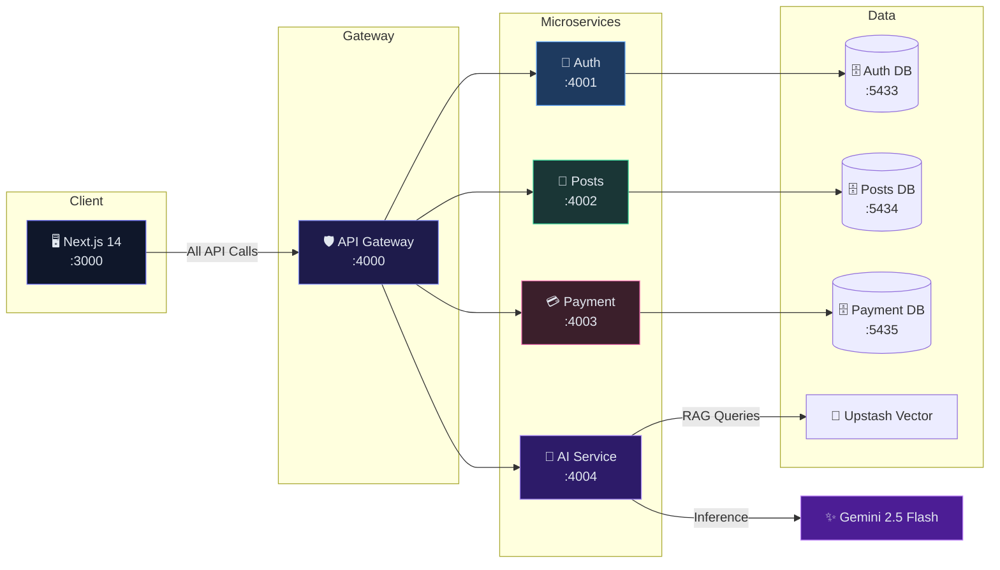
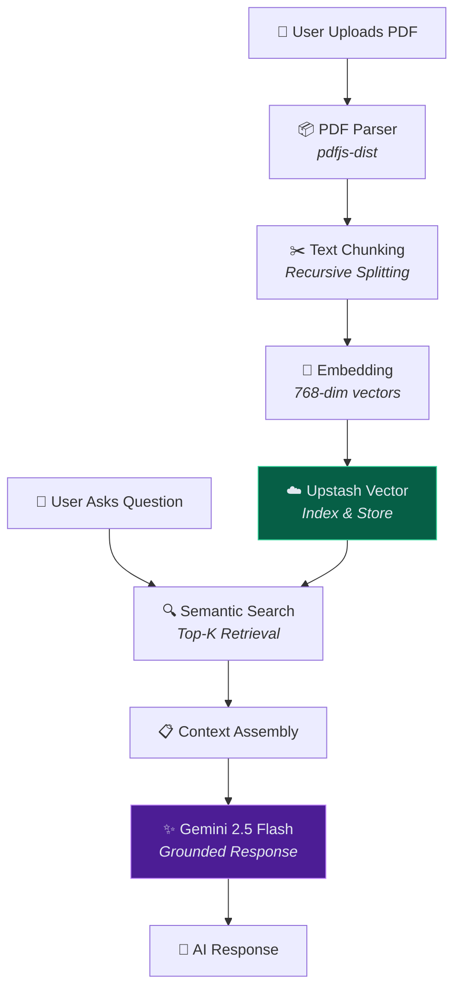
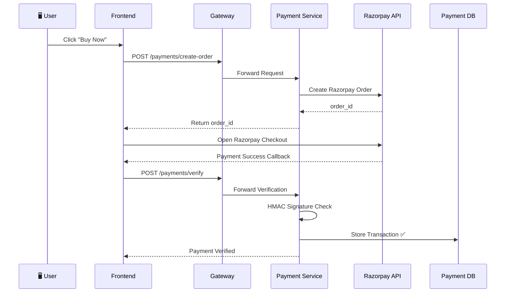
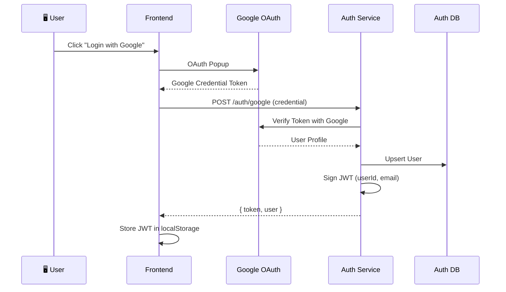

<p align="center">
  
</p>

<p align="center">
  
  
  
  
  
  
  
  
  
</p>

<p align="center">
  <b>A production-ready microservices monorepo with AI-powered RAG, payments, and stateless auth.</b><br/>
  <sub>Ship your SaaS in hours, not weeks. Clone → Configure → Launch.</sub>
</p>

---

## 🧬 Architecture at a Glance



---

## 📡 Service Directory

| | Service | Port | Tech Stack | What It Does |
|:---:|:---|:---:|:---|:---|
| 🧠 | **AI Service** | `4004` | Gemini 2.5 Flash, Upstash Vector, RAG | PDF intelligence, contextual chat, vector embeddings |
| 🔐 | **Auth Service** | `4001` | Google OAuth, JWT, Prisma | Stateless authentication & user management |
| 📝 | **Posts Service** | `4002` | Express, Prisma, JWT Middleware | Community CRUD with owner enforcement |
| 💳 | **Payment Service** | `4003` | Razorpay SDK, Prisma, Webhooks | Order creation, signature verification, ledgering |
| 🛡️ | **API Gateway** | `4000` | Express, http-proxy-middleware | Reverse proxy, CORS, rate-limiting |
| 🖥️ | **Frontend** | `3000` | Next.js 14, Tailwind, React Query | Premium UI with dark/light mode |

---

## 🧠 AI Service — The Intelligence Core

The AI domain is the heartbeat of LUFF. — providing production-ready intelligence out of the box.



| Feature | Details |
|:---|:---|
| **Model** | Google Gemini 2.5 Flash — low-latency, high-quality reasoning |
| **Vector Store** | Upstash Vector — serverless, 768-dimensional embeddings |
| **RAG Pipeline** | Upload → Parse → Chunk → Embed → Store → Query → Generate |
| **Modes** | Generic Chat (direct LLM) + RAG Mode (PDF-grounded answers) |

---

## 💳 Payment Service — Transaction Infrastructure

<details>
<summary><b>🔍 Click to expand Payment Architecture</b></summary>



| Route | Method | Auth | Description |
|:---|:---:|:---:|:---|
| `/payments/create-order` | POST | ✅ | Creates a Razorpay order with amount & currency |
| `/payments/verify` | POST | ✅ | Verifies payment signature (HMAC-SHA256) |
| `/payments/my-purchases` | GET | ✅ | Returns user's transaction history |

</details>

---

## 🔐 Auth Service — Stateless Security

<details>
<summary><b>🔍 Click to expand Authentication Flow</b></summary>



| Route | Method | Auth | Description |
|:---|:---:|:---:|:---|
| `POST /auth/google` | POST | ❌ | Validates Google token, returns JWT |
| `GET /auth/me` | GET | ✅ | Returns authenticated user profile |

</details>

---

## 📝 Posts Service — Community Engine

<details>
<summary><b>🔍 Click to expand Posts Architecture</b></summary>

| Route | Method | Auth | Description |
|:---|:---:|:---:|:---|
| `GET /posts` | GET | ❌ | List all community posts (public) |
| `POST /posts` | POST | ✅ | Create a new post (authenticated) |
| `DELETE /posts/:id` | DELETE | ✅ | Delete own post (owner enforcement) |

- **Database**: Isolated PostgreSQL instance (`posts_db`)
- **ORM**: Prisma with generated client
- **Security**: JWT middleware validates `Authorization: Bearer <token>`

</details>

---

## ⚡ Quick Start

```bash
# 1. Clone & Install
git clone https://github.com/Luff-Org/Luff-Boilerplate.git
cd Luff-Boilerplate && npm install

# 2. Environment Setup
bash scripts/setup-envs.sh

# 3. Start Databases
docker compose -f docker/docker-compose.yml up auth-db posts-db payment-db -d

# 4. Hydrate Schemas
cd backend/auth && npm run db:push && npm run db:generate && cd ../..
cd backend/posts && npm run db:push && npm run db:generate && cd ../..
cd backend/payment && npm run db:push && npm run db:generate && cd ../..

# 5. Launch Everything
npm run run-local
```

> **🧠 AI Setup**: Add your `GEMINI_API_KEY` and Upstash Vector keys to `backend/ai-service/.env` — see [Credentials](#-credentials--api-keys) below.

---

## 🔑 Credentials & API Keys

<details>
<summary><b>🤖 AI Service — Gemini + Upstash</b></summary>

1. Go to [Google AI Studio](https://aistudio.google.com/app/apikey) → Generate API Key
2. Go to [Upstash Console](https://console.upstash.com/vector) → Create Vector Index (768 dimensions)
3. Update `backend/ai-service/.env`:
   ```env
   GEMINI_API_KEY=your_gemini_api_key
   UPSTASH_VECTOR_REST_URL=https://your-index.upstash.io
   UPSTASH_VECTOR_REST_TOKEN=your_token
   ```
</details>

<details>
<summary><b>🔐 Auth Service — Google OAuth</b></summary>

1. Go to [Google Cloud Console](https://console.cloud.google.com/apis/credentials)
2. Create OAuth 2.0 Client ID (Web application)
3. Set redirect to `http://localhost:4000/auth/callback/google`
4. Update `backend/auth/.env` and `frontend/.env`:
   ```env
   GOOGLE_CLIENT_ID=your_client_id
   GOOGLE_CLIENT_SECRET=your_client_secret
   ```
</details>

<details>
<summary><b>💳 Payment Service — Razorpay</b></summary>

1. Sign up at [Razorpay Dashboard](https://dashboard.razorpay.com/)
2. Enable **Test Mode** → Settings → API Keys → Generate
3. Update `backend/payment/.env`:
   ```env
   RAZORPAY_KEY_ID=rzp_test_your_id
   RAZORPAY_KEY_SECRET=your_secret
   ```
</details>

---

## 🐳 Deployment

| Mode | Command | Use Case |
|:---|:---|:---|
| **Local Dev** | `npm run run-local` | Fastest iteration loop |
| **Docker** | `docker compose up --build` | Production-like containers |
| **Kubernetes** | `kubectl apply -f k8s/` | Full GitOps with ArgoCD |

---

## 🗂️ Project Structure

```
Luff-Boilerplate/
├── frontend/              → Next.js 14 App Router
├── backend/
│   ├── api-gateway/       → Reverse Proxy (:4000)
│   ├── auth/              → Google OAuth + JWT (:4001)
│   ├── posts/             → Community CRUD (:4002)
│   ├── payment/           → Razorpay Integration (:4003)
│   └── ai-service/        → Gemini AI + RAG (:4004)
├── shared/                → Shared configs, types, logger
├── docker/                → Docker Compose files
├── k8s/                   → Kubernetes manifests
├── scripts/               → Automation scripts
└── cli/                   → create-luff-app CLI
```

---

## 📄 License

This project is licensed under the [MIT License](LICENSE).

---

<p align="center">
  <sub>Built with ❤️ by <a href="https://github.com/Luff-Org">Luff Org</a></sub>
</p>
