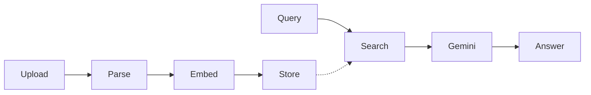

# 🚀 create-luff-app

<p align="center">
  
  
  
  
</p>

> **Scaffold the entire LUFF. microservices ecosystem in one command.**  
> Full-stack Next.js + Express + Prisma + Gemini AI + Razorpay — ready to run.

---

## ⚡ Quick Start

```bash
npx create-luff-app@latest my-app
```

That's it. The CLI will:
1. Clone the boilerplate
2. Ask if you want **AI features** (Gemini + RAG)
3. Install all dependencies
4. Initialize a fresh Git repo

### After Scaffolding

```bash
cd my-app
bash scripts/setup-envs.sh
docker compose -f docker/docker-compose.yml up auth-db posts-db payment-db -d
npm run run-local
```

> 🧠 **AI Users**: Add your `GEMINI_API_KEY` and Upstash Vector keys to `backend/ai-service/.env`

---

## 🏗️ What Gets Scaffolded

```
my-app/
├── frontend/                → Next.js 14 (App Router + Tailwind)
├── backend/
│   ├── api-gateway/         → Reverse Proxy & Rate Limiting (:4000)
│   ├── auth/                → Google OAuth + JWT (:4001)
│   ├── posts/               → Community CRUD (:4002)
│   ├── payment/             → Razorpay Payments (:4003)
│   └── ai-service/          → Gemini 2.5 AI + RAG (:4004)
├── shared/                  → Shared types, config, logger
├── docker/                  → Docker Compose (3 PostgreSQL DBs)
├── k8s/                     → Kubernetes manifests (ArgoCD-ready)
├── scripts/                 → Setup & deployment automation
└── .github/workflows/       → CI/CD pipeline
```

---

## 📡 Service Directory

| | Service | Port | Tech | What It Does |
|:---:|:---|:---:|:---|:---|
| 🧠 | **AI Service** | `4004` | Gemini 2.5 Flash, Upstash Vector | PDF intelligence, contextual chat, RAG |
| 🔐 | **Auth** | `4001` | Google OAuth, JWT, Prisma | Stateless authentication |
| 📝 | **Posts** | `4002` | Express, Prisma | Community posts with owner enforcement |
| 💳 | **Payment** | `4003` | Razorpay SDK, Prisma | Orders, verification, transaction ledger |
| 🛡️ | **Gateway** | `4000` | Express, http-proxy-middleware | CORS, rate-limiting, routing |
| 🖥️ | **Frontend** | `3000` | Next.js 14, Tailwind, React Query | Premium UI with dark/light mode |

---

## 🧠 AI Feature (Opt-In)

During scaffolding, the CLI asks:

```
✨ Would you like to enable the AI Chatbot feature (RAG + Gemini)? (y/n)
```

| Choice | What Happens |
|:---:|:---|
| **Yes** | Full AI service included — chat, PDF upload, RAG pipeline |
| **No** | AI service is removed, gateway routes cleaned up, chat page deleted |

### AI Architecture



---

## 🔑 Credentials Setup

<details>
<summary><b>🧠 AI — Gemini + Upstash</b></summary>

| Get From | What | Put In |
|:---|:---|:---|
| [AI Studio](https://aistudio.google.com/app/apikey) | `GEMINI_API_KEY` | `backend/ai-service/.env` |
| [Upstash](https://console.upstash.com/vector) | `REST_URL` + `TOKEN` | `backend/ai-service/.env` |

Create a Vector Index with **768 dimensions**.
</details>

<details>
<summary><b>🔐 Auth — Google OAuth</b></summary>

| Get From | What | Put In |
|:---|:---|:---|
| [Cloud Console](https://console.cloud.google.com/apis/credentials) | `CLIENT_ID`, `CLIENT_SECRET` | `backend/auth/.env` + `frontend/.env` |

Redirect URI: `http://localhost:4000/auth/callback/google`
</details>

<details>
<summary><b>💳 Payments — Razorpay</b></summary>

| Get From | What | Put In |
|:---|:---|:---|
| [Razorpay](https://dashboard.razorpay.com/) | `KEY_ID`, `KEY_SECRET` | `backend/payment/.env` + `frontend/.env` |

Enable **Test Mode** first.
</details>

---

## 📄 License

[MIT](LICENSE)
